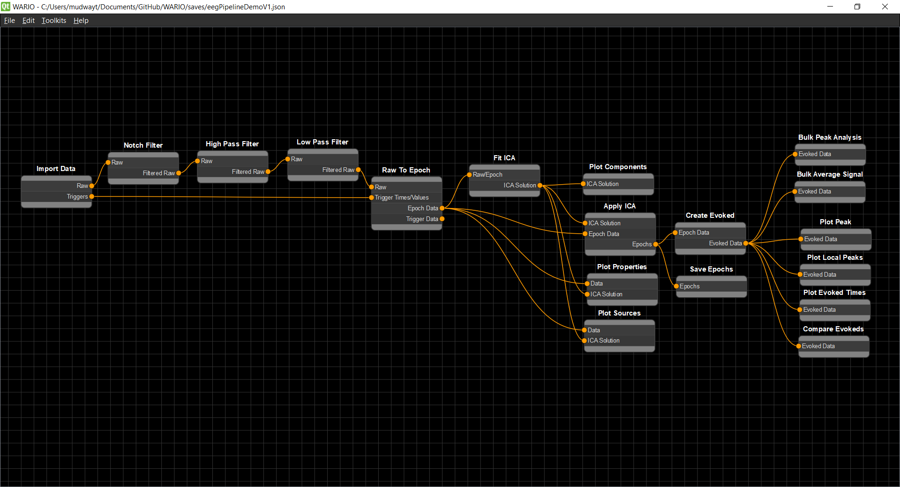

WARIO - Workflow Automation for Research IO
===========================================

A flowchart based data pipeline development suit with a visual interface based on an expanded version of the Nodz library.

Features
---------

* Easy to use flowchart system to create and connect nodes
* Allows for the development of fully working python pipelines
* Supports batch processing and bulk data analysis
* Supports the creation of custom node sets with the built in toolkit system
* Fully customizable settings UI for all nodes
* Global variable system that can be accessed by all nodes during runtime

Documentation Requirements
--------------------------

These are required to compile the documentation. All can be pip installed.

* sphinx  
* sphinx_rtd_theme  
* sphinx-markdown-tables  
* recommonmark

Updating Documentation
----------------------

The documentation can be re-compiled by running the following command inside the WarioEditor\docs folder::

   sphinx-build . _build

Any changes pushed to the master branch should be updated on the readthedocs wiki shortly after

.. toctree::
   :hidden: 
   :maxdepth: 2
   :caption: WARIO Editor
   
   user/installation
   user/userGuide
   user/toolkits
   user/globals
   user/pipeline

.. toctree::
   :hidden: 
   :maxdepth: 2
   :caption: Developer Guide
   
   developer/nodes
   developer/settings
   developer/globals
   developer/toolkits