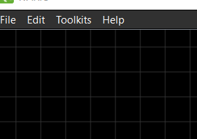

# Toolkits

Toolkits are collections of nodes designed to create pipelines in a specific domain. 

## Configuring Toolkits

The toolkit configuration window (Toolkits menu -> Manage) allows the user to add and remove WARIO toolkits as well as control which ones are currently displayed as selectable in the Toolkits menu. The first time the WARIO editor is ran, the directories within the editor's "toolkits" folder are automatically imported.

To add new toolkits, click the "Add Toolkit" button to open a directory prompt where you can select the directory that contains the toolkit's "config.json" file.  

Only toolkits with the "Display" checkbox checked show under the toolkits menu.

## Activating Toolkits

By default, only the custom node is activated 

Clicking the toolkits listed under the Toolkits menu sets them either active (checked) or inactive (unchecked). When activated, the nodes included in the toolkit can be added to the flowchart. The user cannot set a toolkit inactive after using one of its nodes in the pipeline.

Upon activating a toolkit, the matching documentation (if included) is added as a new tab in the help window.

