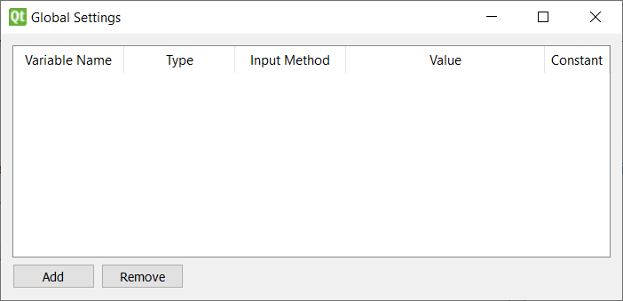
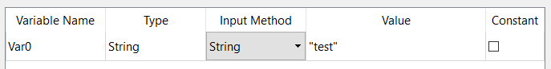
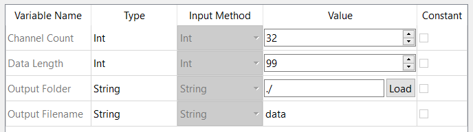

# Global Variables

Pipeline-wide custom variables

## Adding Global Variables
Global variables can be accessed by all nodes during pipeline execution. They are defined in the global variables window, accessible in the Edit menu or by the shortcut given above.  

The buttons at the bottom can be used to add or remove global variables. Be aware that removing a global variable will remove any connections from nodes using that variable. Each variable has \4 components:

* A Unique name
* The Data type 
* An input method selector
* The value
* A checkbox to make the variable a constant (un-editable during execution) 

The data type of the variable sets the type of the attribute when used in a get or set node (see below). Global variables with the "File" type can be connected to nodes of any data type. The input method selector allows you to create global variables of various types such as text, integers, floats, file/folder paths and lists. There is also a "Custom" input method option that allows you to import a custom UI to input the global data. See [the developer guide](../developer/globals.md) for more information.

Attempting to use the same name for two variables will revert the modified variable to its original name. Modifying a global variable's name or type will remove all connections so as not to create invalid paths. 

## Toolkit Global Variables

Some toolkits include default global variables that are automatically added when the toolkit is enabled. These global variables can only be removed when the toolkit is disabled. Their name, type, input type and constant bool are fixed but the value held by them can be changed. These variables appear greyed out, as seen below.  

## Including Global Variables In Flowcharts

You can use global variables in your flowcharts by creating "Get Global" and "Set Global" nodes which retrieve and modify global variables respectively. These are found in the "input" and "output" categories of the default toolbox and function in the same way as any other node, with a setting that allows you to select the global variable for the node. 

Global variables are passed to all nodes when ran so custom nodes can make use of them without requiring the get/set nodes. See [Custom Nodes](../developer/nodes.md) for more information.  

**BE AWARE:** There is no guarantee what order the flowchart will be computed other than no node running until all of its input nodes have ran. This means that using the "Set Global" node to make a change to a global variable that another node relies on could result in undefined behavior. 
 
