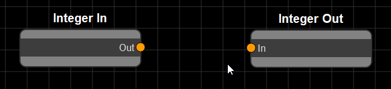

# Using WARIO
How to interact with the WARIO interface

---

## Shortcuts
* Ctrl+S - Save*
* Ctrl+R - Save/Load & Run*
* Ctrl+L - Load*
* Ctrl+G - Global Variables*

### Manipulating Nodes

* Right click - Add new node
* Double click on node - Modify node settings
* S - Snap selected node to grid

### Navigating the Flowchart

* F - Focus on selected node(s)
* Alt+Left click - Drag flowchart
* Scroll wheel - zoom in/out

All commands marked with a * can also be found in the menu bar

---

## Creating New Nodes

To create a new node, right click on the WARIO interface, select a toolbox and category and click the node you wish to create. The node will appear under where the interface was clicked.

---

## Connecting Nodes

Clicking on the circle next to an attribute name and dragging creates a link that can be connected to another node's attribute so long as they are of the same type.

  

Attributes who's type do not match appear greyed out 

You can see what the type of an attribute is by hovering over its connector, showing a tooltip

---

## Custom Nodes
To create a custom node, right click on the flowchart interface and select "Custom Node". This node will initially have no attributes. The settings menu for this node allows you to import a node, along with its settings window (which must be defined in the same file). This will populate the attributes of the node and replace the default settings window with that defined for the custom node. For more information on how to create custom nodes, see [the developer guide](../developer/nodes.md)